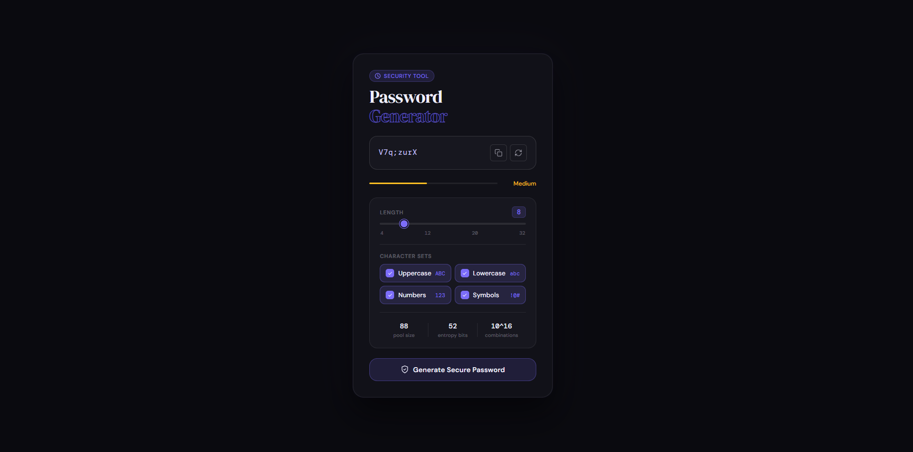
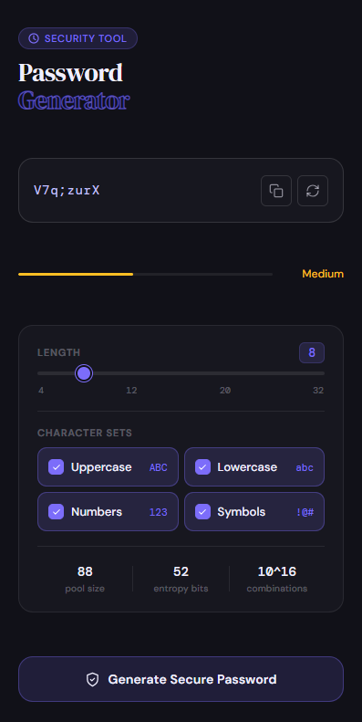

# 🔐 VolPass

> A modern, secure, responsive Password Generator Web Application built with React.js featuring password strength analysis, entropy calculation, customizable character sets, clipboard support, responsive UI, and secure API-powered password generation.

[](https://your-live-demo-link.netlify.app)
[](https://reactjs.org)
[](https://developer.mozilla.org/en-US/docs/Web/CSS)
[](https://axios-http.com)

---

# 📸 Screenshots

| Desktop View | Mobile View |
|---|---|
|  |  |

---

# 🚀 Live Demo

🔗 **[https://ak-pass.netlify.app](https://ak-pass.netlify.app/)**

---

# ✨ Features

## 🔒 Secure Password Generation

- Generate highly secure random passwords
- API-powered password generation
- Strong randomness support
- One-click regeneration

---

## 🎛 Password Customization

Customize passwords using:

- 🔠 Uppercase letters
- 🔡 Lowercase letters
- 🔢 Numbers
- 🔣 Symbols

Users can enable or disable any character set dynamically.

---

## 📏 Adjustable Password Length

- Password length slider
- Range from 4 to 32 characters
- Real-time length updates

---

## 📊 Password Strength Indicator

Includes real-time strength analysis:

- Weak
- Medium
- Strong
- Very Strong

Strength is calculated using:

- Character variety
- Password length
- Entropy score
- Pool size

---

## 🧠 Entropy & Security Analysis

Displays advanced security metrics:

- Character pool size
- Entropy bits
- Total possible combinations

Helps users understand password security.

---

## 📋 Clipboard Support

- One-click copy to clipboard
- Success feedback animation
- Instant usability

---

## ⚡ Real-Time UI Updates

- Smooth interactions
- Dynamic updates
- Instant password generation
- Live visual feedback

---

## 🌙 Modern Futuristic UI

- Dark glassmorphism design
- Neon accent styling
- Smooth animations
- Modern security dashboard appearance

---

## 📱 Fully Responsive Design

Optimized for:

- Mobile devices
- Tablets
- Laptops
- Large desktop screens

Includes fullscreen mobile experience similar to modern native apps.

---

# 🛠️ Tech Stack

## Frontend

| Technology | Purpose |
|---|---|
| React.js 18 | UI Framework |
| React Hooks | State Management |
| Axios | API Requests |
| CSS3 | Styling & Animations |

---

## Backend API

| Technology | Purpose |
|---|---|
| Django / Python API | Password Generation |
| Railway | Backend Hosting |

---

# 📁 Project Structure

```bash
volpass/
├── public/
│
├── src/
│   ├── App.jsx
│   ├── App.css
│   ├── main.jsx
│   └── assets/
│
├── screenshot/
│   ├── desktop.png
│   └── mobile.png
│
├── package.json
└── README.md
```

---

# ⚙️ Getting Started

## Prerequisites

- npm or yarn

---

# 📥 Installation

```bash
# 1. Clone repository
git clone https://github.com/rkhassan420/volpass.git

# 2. Navigate to project
cd volpass

# 3. Install dependencies
npm install

# 4. Start development server
npm run dev
```

Application runs at:

```bash
http://localhost:3000
```

---

# 🧠 Core Functionalities

## 🔐 Generate Password

```js
const generatePassword = async () => {
  const res = await axios.post(API_URL, {
    length,
    use_upper: opts.upper,
    use_lower: opts.lower,
    use_digits: opts.digits,
    use_symbols: opts.symbols,
  });

  setPassword(res.data.password);
};
```

---

## 📋 Copy to Clipboard

```js
navigator.clipboard.writeText(password)
```

---

## 📊 Entropy Calculation

```js
const entropyBits = Math.round(
  length * Math.log2(poolSize)
)
```

Higher entropy means stronger passwords and better resistance against brute-force attacks.

---

## 🎯 Strength Detection

```js
if (score >= 6) return "Very Strong";
if (score >= 5) return "Strong";
if (score >= 3) return "Medium";
return "Weak";
```

---

# 🎨 UI Features

## Modern Design Includes

- Glassmorphism effects
- Animated buttons
- Interactive sliders
- Responsive card layout
- Smooth hover transitions
- Neon accent highlights

---

# 📱 Responsive Design

| Device | Layout |
|---|---|
| Mobile | Fullscreen responsive UI |
| Tablet | Balanced centered layout |
| Desktop | Modern dashboard interface |
| Large Screens | Spacious adaptive design |

---

# 🔒 Security Features

- Strong character randomization
- Entropy-based calculations
- Large combination space
- Brute-force resistant password generation

---

# 🚀 Future Improvements

- Password history
- Offline password generation
- Password breach detection
- AI-powered password recommendations
- Export generated passwords
- Multi-language support
- Dark/Light theme switcher

---

# 🧪 Run Production Build

```bash
npm run build
```

---

# 🚀 Deployment

## Netlify / Vercel Deployment

```bash
npm run build
```

Upload the generated `dist` folder to Netlify or Vercel  
or connect your GitHub repository for automatic deployment.

---

# 🤝 Contributing

Contributions are welcome!

```bash
1. Fork the repository
2. Create your feature branch
3. Commit your changes
4. Push to the branch
5. Open a Pull Request
```

---

# 👨‍💻 Author

## Ali Hassan

- GitHub: [@rkhassan420](https://github.com/rkhassan420)
- LinkedIn: [linkedin.com/in/ali-hassan-dev01](https://www.linkedin.com/in/ali-hassan-dev01/)
- Portfolio: [https://showcraft.netlify.app/portfolio/ali11243](https://showcraft.netlify.app/portfolio/ali11243)

---

# ⭐ Support

If you like this project:

- Give it a ⭐ on GitHub
- Share it with others
- Fork and contribute

---

# ❤️ Acknowledgements

Built with React.js and modern frontend practices to create a beautiful and secure password generation experience.

---

<p align="center">
  Made with ❤️ by Ali Hassan
</p>
